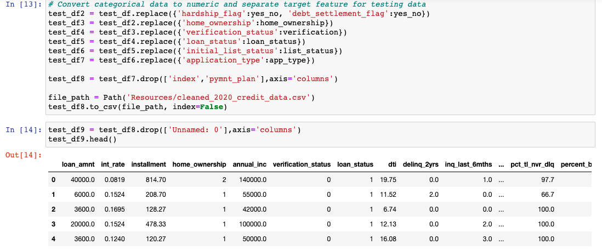
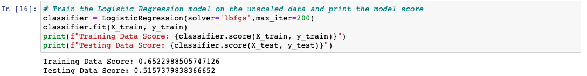
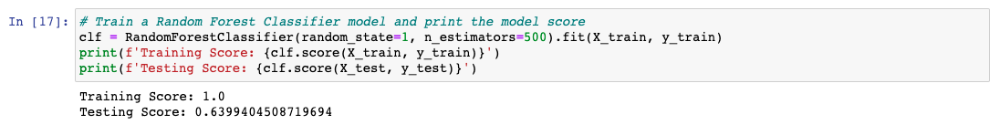

# Predicting Credit Risk

In this project, I will be building a machine learning model that attempts to predict whether a loan from LendingClub will become high risk or not. 

## Background

LendingClub is a peer-to-peer lending services company that allows individual investors to partially fund personal loans as well as buy and sell notes backing the loans on a secondary market. LendingClub offers their previous data through an API.

I will be using this data to create machine learning models to classify the risk level of given loans. Specifically, I will be comparing the Logistic Regression model and Random Forest Classifier.

## Converting categorical data to numeric

## Fitting a LogisticRegression model

## Fitting a RandomForestClassifier model

## Results
When comparing the two models without scaling the data, the random forest model performed better on the test data. The lack of scaling seems to have had an impact on the test data.

With scaling the logistic regression model performed better than random forest model with a .66 accurancy score.
The random forest model decreased in accuracy from .64 t0 .56 WITH scaled data.  
Random forest is a tree-based model and is not affected by feature scaling. 
The model does not rely on scaled data to make accurate predictions unlike logistic regression models.
